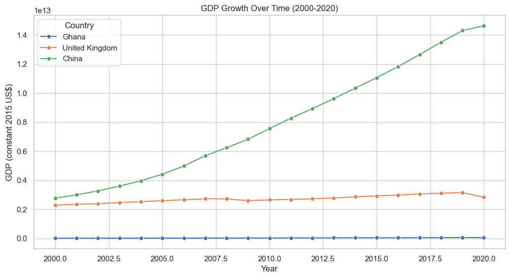
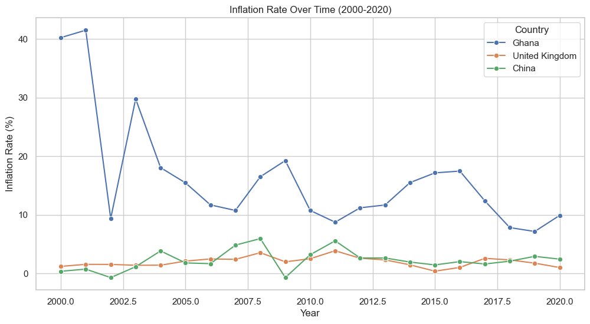
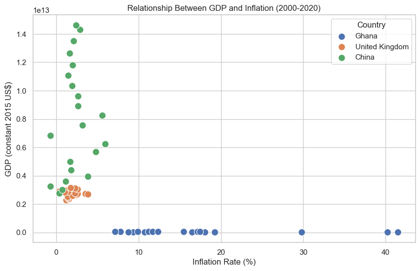

# Economic Analysis Project

## Overview
This project analyzes economic data from Ghana, the United Kingdom, and China to compare GDP growth and inflation rates over the period 2000-2020. The analysis highlights the differences between developing, developed, and rapidly growing economies.

## Data Source
The data used in this analysis is sourced from **World Bank Open Data**, a reliable and publicly available dataset for global economic indicators.

## Methodology
1. **Data Collection:** GDP and inflation data for Ghana, the United Kingdom, and China were extracted from the World Bank Open Data portal.
2. **Data Cleaning:** The data was cleaned to remove missing values and ensure consistency across the three countries.
3. **Analysis:** 
   - GDP growth trends were analyzed to compare economic performance.
   - Inflation rates were examined to understand price stability in each country.
   - The relationship between GDP growth and inflation was explored to identify patterns.
4. **Visualization:** Key trends were visualized using line charts and bar graphs, which are included in this repository.

---

## Visualizations

### 1. GDP Growth Over Time (2000-2020)

*Figure 1: GDP growth trends for Ghana, the United Kingdom, and China (2000-2020).*

- **Ghana:** Steady GDP growth driven by agriculture, mining, and oil production.
- **United Kingdom:** Stable GDP growth reflecting a mature, service-based economy.
- **China:** Explosive GDP growth driven by manufacturing, exports, and infrastructure development.

**Key Takeaway:**
- Ghana's GDP growth shows potential but is smaller and more volatile.
- The UK's GDP growth is stable but slower, reflecting its mature economy.
- China's GDP growth is the fastest, reflecting its rapid industrialization and global trade dominance.

### 2. Inflation Rate Over Time (2000-2020)

*Figure 2: Inflation rate trends for Ghana, the United Kingdom, and China (2000-2020).*

- **Ghana:** Higher inflation rates due to currency fluctuations and reliance on imports.
- **United Kingdom:** Low and stable inflation, typical of a developed economy.
- **China:** Moderate inflation despite rapid growth, thanks to strong government control.

**Key Takeaway:**
- Ghana's high inflation reflects the challenges of a developing economy.
- The UK's low inflation shows the stability of a developed economy.
- China's moderate inflation reflects its controlled and fast-growing economy.

### 3. Relationship Between GDP and Inflation

*Figure 3: Relationship between GDP growth and inflation for Ghana, the United Kingdom, and China.*

- **Ghana:** Higher GDP growth often leads to higher inflation due to reliance on imports and less stable economic policies.
- **United Kingdom:** GDP growth and inflation are balanced, reflecting the efficiency and stability of a mature economy.
- **China:** Despite rapid GDP growth, inflation has been controlled through strong government policies.

**Key Takeaway:**
- Ghana's economy shows that rapid growth can lead to higher inflation in developing countries.
- The UK's economy demonstrates that growth and inflation can be balanced in a developed economy.
- China's economy proves that even with rapid growth, inflation can be controlled with strong policies.

---

## Conclusion
This analysis highlights the distinct economic performances of Ghana, the United Kingdom, and China:

- **Ghana:** A developing economy with steady GDP growth but high and volatile inflation. Challenges include reliance on natural resources and imports.
- **United Kingdom:** A developed economy with stable GDP growth and low inflation. Its mature, service-based economy ensures long-term stability.
- **China:** A rapidly growing economy with explosive GDP growth and controlled inflation. Strong government policies have enabled it to manage growth and inflation effectively.

Understanding these differences helps illustrate how economic policies, resources, and global factors shape a country's economic performance.

---

## How to Reproduce
1. Clone this repository.
2. Install the required dependencies (e.g., Python, pandas, matplotlib).
3. Run the analysis script:
   ```bash
   python analysis_script.py
