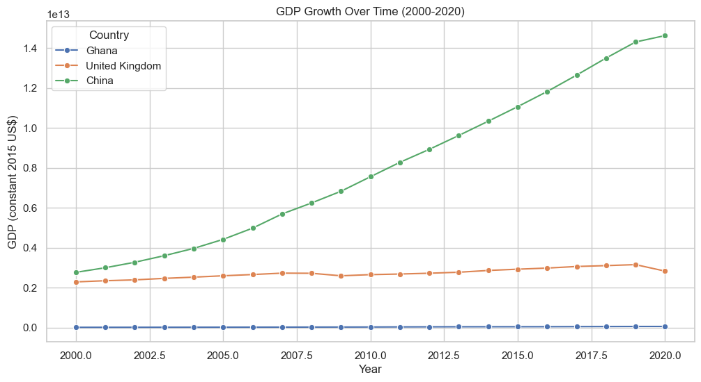

```python

```


```python
import pandas as pd
import matplotlib.pyplot as plt
import seaborn as sns

sns.set_theme(style="whitegrid")

# Load data
gdp = pd.read_csv(r"C:\Users\nanan\OneDrive\Desktop\jupy\gdp\gdp.csv", skiprows=4)
inflation = pd.read_csv(r"C:\Users\nanan\OneDrive\Desktop\jupy\inflation\inflation.csv", skiprows=4)

# Filter for Ghana, United Kingdom, and China
selected_countries = ["Ghana", "United Kingdom", "China"]
gdp_filtered = gdp[gdp["Country Name"].isin(selected_countries)]
inflation_filtered = inflation[inflation["Country Name"].isin(selected_countries)]

# Drop unnecessary columns
gdp_filtered = gdp_filtered.drop(columns=["Country Code", "Indicator Name", "Indicator Code"])
inflation_filtered = inflation_filtered.drop(columns=["Country Code", "Indicator Name", "Indicator Code"])

# Set Country Name as the index
gdp_filtered = gdp_filtered.set_index("Country Name")
inflation_filtered = inflation_filtered.set_index("Country Name")

# Filter for years 2000 to 2020
years = [str(year) for year in range(2000, 2021)]  # List of years as strings
gdp_filtered = gdp_filtered[years]
inflation_filtered = inflation_filtered[years]

# Transpose the data to have years as rows
gdp_filtered = gdp_filtered.T
inflation_filtered = inflation_filtered.T

# Convert the index (years) to integers
gdp_filtered.index = gdp_filtered.index.astype(int)
inflation_filtered.index = inflation_filtered.index.astype(int)

# Combine GDP and Inflation data into a single DataFrame
economic_data = {}
for country in selected_countries:
    economic_data[country] = pd.DataFrame({
        "GDP": gdp_filtered[country],
        "Inflation": inflation_filtered[country]
    })

# Plot GDP Growth Over Time for Each Country
plt.figure(figsize=(12, 6))
for country, data in economic_data.items():
    sns.lineplot(data=data, x=data.index, y="GDP", label=country, marker="o")
plt.title("GDP Growth Over Time (2000-2020)")
plt.xlabel("Year")
plt.ylabel("GDP (constant 2015 US$)")
plt.legend(title="Country")
plt.show()

# Plot Inflation Rate Over Time for Each Country
plt.figure(figsize=(12, 6))
for country, data in economic_data.items():
    sns.lineplot(data=data, x=data.index, y="Inflation", label=country, marker="o")
plt.title("Inflation Rate Over Time (2000-2020)")
plt.xlabel("Year")
plt.ylabel("Inflation Rate (%)")
plt.legend(title="Country")
plt.show()

# Plot Relationship Between GDP and Inflation for Each Country
plt.figure(figsize=(10, 6))
for country, data in economic_data.items():
    sns.scatterplot(data=data, x="Inflation", y="GDP", label=country, s=100)
plt.title("Relationship Between GDP and Inflation (2000-2020)")
plt.xlabel("Inflation Rate (%)")
plt.ylabel("GDP (constant 2015 US$)")
plt.legend(title="Country")
plt.show()
```


    

    


    

    


    

    


```python

```
